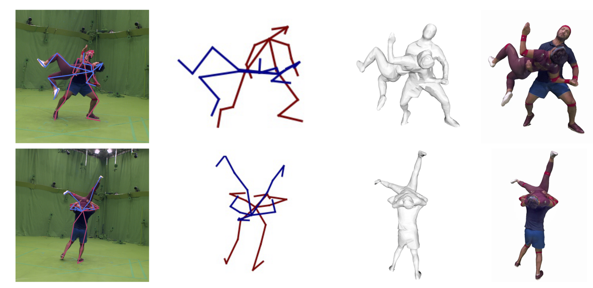
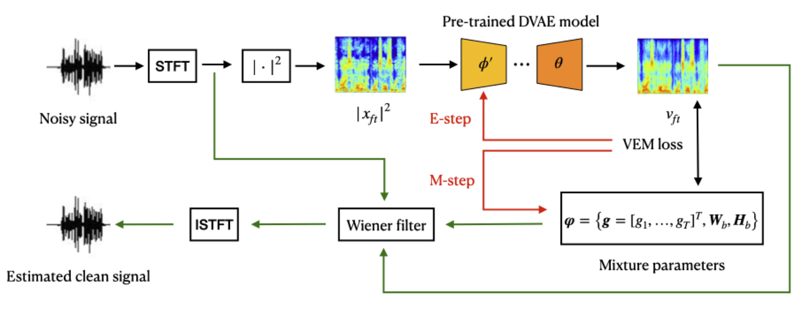

<!-- 
  You can also find my articles on <u><a href="{{author.googlescholar}}">my Google Scholar profile</a>.</u>





  
 -->

Here is a selection of recent publications, full list can be found on [Google Scholar](https://scholar.google.com/citations?user=Ymz1-_0AAAAJ&hl=en)

<!-- 2021 arXiv ExPI-->
<article class="row">
  

    <figure class="image">
      
    </figure>
  

  

    <figure class="image">
      
    </figure>
  

  

    

      

        <b>Multi-Person Extreme Motion Prediction</b> 
        Wen Guo*, <b>Xiaoyu BIE*</b>, Xavier Alameda-Pineda, Francesc Moreno 
        <i>arXiv preprint arXiv:2105.08825.</i> 
        <a href="https://arxiv.org/pdf/2105.08825.pdf" target="_blank">[Paper]</a>
        <a href="https://team.inria.fr/robotlearn/multi-person-extreme-motion-prediction-with-cross-interaction-attention" target="_blank">[Project page]</a>
        [Code] [Dataset]
      

    

  

</article>

<!-- 2021 arXiv DVAE SE-->
<article class="row">
  

    <figure class="image">
      
    </figure>
  

  

    <figure class="image">
      
    </figure>
  

  

    

      

        <b>Unsupervised Speech Enhancement using Dynamical Variational Auto-Encoders</b> 
        <b>Xiaoyu BIE</b>, Simon Leglaive, Xavier Alameda-Pineda, Laurent Girin 
        <i>arXiv preprint arXiv:2106.12271.</i> 
        <a href="https://arxiv.org/pdf/2106.12271.pdf" target="_blank">[Paper]</a>
        [Code]
      

    

  

</article>

<!-- 2022 FnT DVAE -->
<article class="row">
  

    <figure class="image">
      
    </figure>
  

  

    <figure class="image">
      
    </figure>
  

  

    

      

        <b>Dynamical Variational Autoencoders: A Comprehensive Review</b> 
        Laurent Girin, Simon Leglaive, <b>Xiaoyu BIE</b>, Julien Diard, Thomas Hueber, Xavier Alameda-Pineda 
        <i>Foundations and Trends in Machine Learning, 2022, Vol. 15, No. 1-2, pp 1–175.</i> 
        <!-- <i>Foundations and Trends in Machine Learning, To appear.</i>  -->
        <a href="https://arxiv.org/pdf/2008.12595.pdf" target="_blank">[Paper]</a>
        <a href="https://team.inria.fr/robotlearn/dvae/" target="_blank">[Project page]</a>
        <a href="https://github.com/XiaoyuBIE1994/DVAE" target="_blank">[Code]</a>
        <a href="https://www.youtube.com/watch?v=-Ix8k6BVOeU&list=PLuZsCU0LDHDeEusitbdY6bNKOEhqh6DnS&t=5s" target="_blank">[Tutorial]</a>
      

    

  

</article>

<!-- 2021 Interspeech DVAE -->
<article class="row">
  

    <figure class="image">
      
    </figure>
  

  

    <figure class="image">
      
    </figure>
  

  

    

      

        <b>A Benchmark of Dynamical Variational Autoencoders applied to Speech Spectrogram Modeling</b> 
        <b>Xiaoyu BIE</b>, Laurent Girin, Simon Leglaive, Thomas Hueber, Xavier Alameda-Pineda 
        <i><b>Interspeech</b>, 2021.</i> 
        <a href="https://www.isca-speech.org/archive/pdfs/interspeech_2021/bie21_interspeech.pdf" target="_blank">[Paper]</a>
        <a href="https://team.inria.fr/robotlearn/a-benchmark-of-dynamical-variational-autoencoders-applied-to-speech-spectrogram-modeling" target="_blank">[Project page]</a>
        <a href="https://github.com/XiaoyuBIE1994/DVAE" target="_blank">[Code]</a>
      

    

  

</article>

