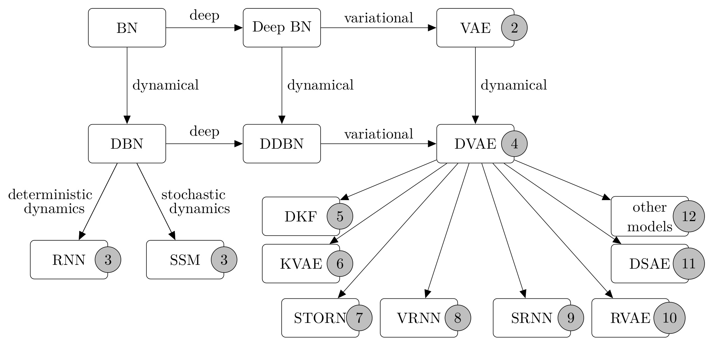

<!-- 
  You can also find my articles on <u><a href="{{author.googlescholar}}">my Google Scholar profile</a>.</u>





  
 -->
 
Here is a selection of recent publications, full list can be found on [Google Scholar](https://scholar.google.com/citations?user=Ymz1-_0AAAAJ&hl=en)

<article class="columns">
  

    <figure class="image">
      
    </figure>
  

  

    

      

        <b>Foundations and Trends in Machine Learning</b> 
        <a href="http://www.gipsa-lab.grenoble-inp.fr/~laurent.girin/cv_en.html" target="_blank" class="dark">Laurent Girin</a>, <a href="https://sleglaive.github.io/index.html" target="_blank" class="dark">Simon Leglaive</a>, <b>Xiaoyu BIE</b>, <a href="https://diard.wordpress.com/" target="_blank" class="dark">Julien Diard</a>, <a href="http://www.gipsa-lab.grenoble-inp.fr/~thomas.hueber/index_en.html" target="_blank" class="dark">Thomas Hueber</a>, <a href="http://xavirema.eu/" target="_blank" class="dark">Xavier Alameda-Pineda</a> 
        <i>Foundations and Trends in Machine Learning, 2021, Vol. 15, No. 1-2, pp 1–175. DOI: 10.1561/2200000089</i> 
        <a href="https://arxiv.org/pdf/2008.12595.pdf" target="_blank">[arXiv]</a>
        <a href="https://team.inria.fr/robotlearn/dvae/" target="_blank">[Project page]</a>
        <a href="https://github.com/XiaoyuBIE1994/DVAE" target="_blank">[Code]</a>
        <a href="https://dynamicalvae.github.io/" target="_blank">[Tutorial @ICASPP 2021]</a>
      

    

  

</article>

## Preiprint  
**[U1]** **Xiaoyu Bie**, Simon Leglaive, Xavier Alameda-Pineda and Laurent Girin, "Unsupervised Speech Enhancement using Dynamical Variational Auto-Encoders", arXiv preprint arXiv:2106.12271. [[pdf](https://arxiv.org/pdf/2106.12271.pdf)] [Code]  
**[U2]** Wen Guo*, __Xiaoyu Bie*__, Xavier Alameda-Pineda and Francesc Moreno, "Multi-PersonExtreme Motion Prediction", arXiv preprint arXiv:2105.08825,2021. [[pdf](https://arxiv.org/pdf/2105.08825.pdf)] [[Project Page](https://team.inria.fr/robotlearn/multi-person-extreme-motion-prediction-with-cross-interaction-attention/)] [Code] [Dataset]  

## Conference papers  
**[C1]** **Xiaoyu Bie**, Laurent Girin, Simon Leglaive, Thomas Hueber and Xavier Alameda-Pineda, "A Benchmark of Dynamical Variational Autoencoders applied to Speech Spectrogram Modeling", **Interspeech**, 2021. [[pdf](https://www.isca-speech.org/archive/pdfs/interspeech_2021/bie21_interspeech.pdf)] [[Project Page](https://team.inria.fr/robotlearn/a-benchmark-of-dynamical-variational-autoencoders-applied-to-speech-spectrogram-modeling)] [[Code](https://github.com/XiaoyuBIE1994/DVAE)]  

## Journal papers  
**[J1]** Laurent Girin, Simon Leglaive, **Xiaoyu Bie**, Julien Diard, Thomas Hueber and Xavier Alameda-Pineda, "Dynamical Variational Autoencoders: A Comprehensive Review", **Foundations and Trends in Machine Learning**, 2021, Vol. 15, No. 1-2, pp 1–175. DOI: 10.1561/2200000089. [[pdf](https://arxiv.org/pdf/2008.12595.pdf)] [[Project Page](https://team.inria.fr/robotlearn/dvae/)] [[Code](https://github.com/XiaoyuBIE1994/DVAE)] [[Tutorial @ICASPP 2021](https://dynamicalvae.github.io/)]

