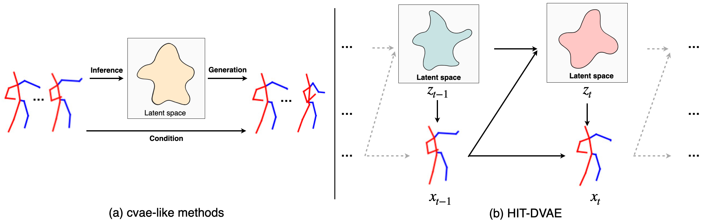
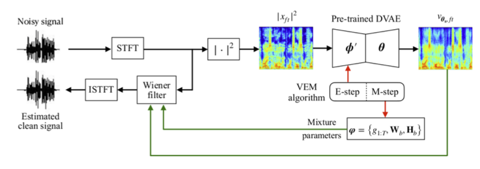
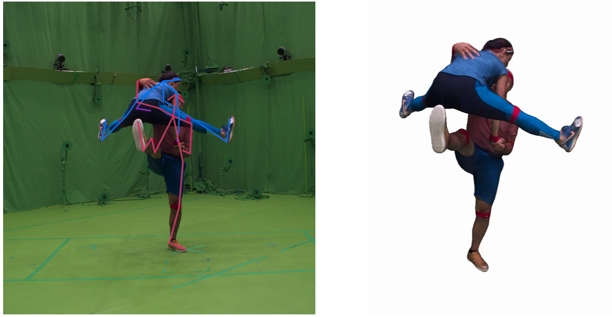
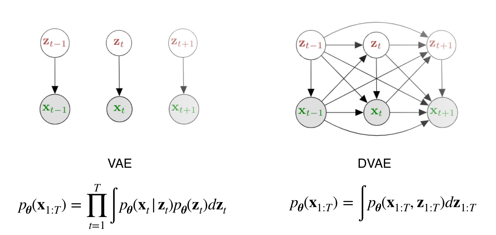

<!-- 
  You can also find my articles on <u><a href="{{author.googlescholar}}">my Google Scholar profile</a>.</u>





  
 -->

Here is a selection of recent publications, full list can be found on [Google Scholar](https://scholar.google.com/citations?user=Ymz1-_0AAAAJ&hl=en)  
\* indicates equal contribution.

<!-- 2025 ICASSP SD-Codec-->
<article class="row">
  

    <figure class="image">
      
    </figure>
  

  

    <figure class="image">
      
    </figure>
  

  

    

      

        <b>Learning Source Disentanglement in Neural Audio Codec</b> 
        <b>Xiaoyu BIE</b>, Xubo Liu, Gaël Richard 
        <i>IEEE International Conference on Acoustic, Speech and Signal Procssing (<b>ICASSP</b>), 2025</i> 
        <a href="https://arxiv.org/abs/2409.11228" target="_blank">[arXiv]</a>
        <a href="https://xiaoyubie1994.github.io/sdcodec" target="_blank">[Project page]</a>
        <a href="https://github.com/XiaoyuBIE1994/SDCodec" target="_blank">[Code]</a>
      

    

  

</article>

<!-- 2022 arXiv HiT DVAE-->
<article class="row">
  

    <figure class="image">
      
    </figure>
  

  

    <figure class="image">
      
    </figure>
  

  

    

      

        <b>HiT-DVAE: Human Motion Generation via Hierarchical Transformer Dynamical VAE</b> 
        <b>Xiaoyu BIE*</b>, Wen Guo*, Simon Leglaive, Laurent Girin, Francesc Moreno-Noguer, Xavier Alameda-Pineda 
        <i>arXiv preprint arXiv:2204.01565</i> 
        <a href="https://arxiv.org/abs/2204.01565" target="_blank">[arXiv]</a>
      

    

  

</article>

<!-- 2022 TASLP DVAE SE-->
<article class="row">
  

    <figure class="image">
      
    </figure>
  

  

    <figure class="image">
      
    </figure>
  

  

    

      

        <b>Unsupervised Speech Enhancement using Dynamical Variational Auto-Encoders</b> 
        <b>Xiaoyu BIE</b>, Simon Leglaive, Xavier Alameda-Pineda, Laurent Girin 
        <i>IEEE/ACM Transactions on Audio, Speech and Language Processing (<b>TASLP</b>), 2022.</i> 
        <a href="https://arxiv.org/abs/2106.12271" target="_blank">[arXiv]</a>
        <a href="https://ieeexplore.ieee.org/document/9894060" target="_blank">[Paper]</a>
        <a href="https://team.inria.fr/robotlearn/unsupervised-speech-enhancement-using-dynamical-variational-auto-encoders/" target="_blank">[Project page]</a>
        <a href="https://github.com/XiaoyuBIE1994/DVAE_SE" target="_blank">[Code]</a>
        
      

    

  

</article>

<!-- 2022 ExPI-->
<article class="row">
  

    <figure class="image">
      
    </figure>
  

  

    <figure class="image">
      
    </figure>
  

  

    

      

        <b>Multi-Person Extreme Motion Prediction</b> 
        Wen Guo*, <b>Xiaoyu BIE*</b>, Xavier Alameda-Pineda, Francesc Moreno-Noguer 
        <i>IEEE/CVF Conference on Computer Vision and Pattern Recognition (<b>CVPR</b>), 2022.</i> 
        <a href="https://arxiv.org/abs/2105.08825" target="_blank">[arXiv]</a>
        <a href="https://openaccess.thecvf.com/content/CVPR2022/html/Guo_Multi-Person_Extreme_Motion_Prediction_CVPR_2022_paper.html" target="_blank">[Paper]</a>
        <a href="https://team.inria.fr/robotlearn/multi-person-extreme-motion-prediction" target="_blank">[Project page]</a>
        <a href="https://zenodo.org/record/5578329#.Ya_TCvGZP0q" target="_blank">[Dataset]</a>
        <a href="https://github.com/GUO-W/MultiMotion" target="_blank">[Code]</a>
      

    

  

</article>

<!-- 2021 FnT DVAE -->
<article class="row">
  

    <figure class="image">
      
    </figure>
  

  

    <figure class="image">
      
    </figure>
  

  

    

      

        <b>Dynamical Variational Autoencoders: A Comprehensive Review</b> 
        Laurent Girin, Simon Leglaive, <b>Xiaoyu BIE</b>, Julien Diard, Thomas Hueber, Xavier Alameda-Pineda 
        <i>Foundations and Trends in Machine Learning, 2021, Vol. 15, No. 1-2, pp 1–175.</i> 
        <!-- <i>Foundations and Trends in Machine Learning, To appear.</i>  -->
        <a href="https://arxiv.org/abs/2008.12595" target="_blank">[arXiv]</a>
        <a href="https://www.nowpublishers.com/article/Details/MAL-089" target="_blank">[Paper]</a>
        <a href="https://team.inria.fr/robotlearn/dvae/" target="_blank">[Project page]</a>
        <a href="https://www.youtube.com/watch?v=-Ix8k6BVOeU&list=PLuZsCU0LDHDeEusitbdY6bNKOEhqh6DnS&t=5s" target="_blank">[Tutorial]</a>
        <a href="https://github.com/XiaoyuBIE1994/DVAE" target="_blank">[Code]</a> 
        
      

    

  

</article>

<!-- 2021 Interspeech DVAE -->
<article class="row">
  

    <figure class="image">
      
    </figure>
  

  

    <figure class="image">
      
    </figure>
  

  

    

      

        <b>A Benchmark of Dynamical Variational Autoencoders applied to Speech Spectrogram Modeling</b> 
        <b>Xiaoyu BIE</b>, Laurent Girin, Simon Leglaive, Thomas Hueber, Xavier Alameda-Pineda 
        <i><b>Interspeech</b>, 2021.</i> 
        <a href="https://arxiv.org/abs/2106.06500" target="_blank">[arXiv]</a>
        <a href="https://www.isca-speech.org/archive/interspeech_2021/bie21_interspeech.html" target="_blank">[Paper]</a>
        <a href="https://team.inria.fr/robotlearn/interspeech21-dvae/" target="_blank">[Project page]</a>
        <a href="https://github.com/XiaoyuBIE1994/DVAE" target="_blank">[Code]</a>
      

    

  

</article>

